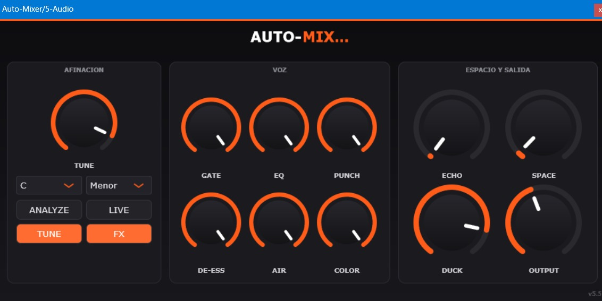

# Auto-Mixer 🎚️ — Vocal Chain VST3 Plugin

> A VST3 audio plugin built with **JUCE / C++** that applies a professional vocal mixing chain. Born from real-world experience mixing and mastering **100+ productions** for independent artists.



## Why this exists

After mixing more than a hundred vocal tracks by hand, the same chain of decisions kept repeating. Auto-Mixer encodes that workflow into a plugin: load it on a vocal track and get a solid starting point instantly, then fine-tune from there.

## Features

- [x] **Real-time pitch correction** with key and scale snapping (major, minor, chromatic), formant preservation, and a hard-tune curve for the modern vocal sound
- [x] **ANALYZE button** — listens for 15 seconds and detects the key of the track using Krumhansl-Schmuckler profiles, then sets the key and scale selectors on its own
- [x] **LIVE mode** — swaps the detection window from 2048 to 1024 samples, trading pitch range for roughly half the latency for tracking and live use
- [x] **Full vocal chain in one plugin**: noise gate → tuner → EQ → two-stage compression with automatic makeup gain → multiband de-esser → air shelves → tape-style saturation → tempo-synced echo → reverb, both ducked by the voice → output gain → safety limiter
- [x] **Echo synced to the host tempo** — reads the BPM from the DAW playhead and places the delay on a dotted eighth, with the right channel offset for stereo width
- [x] **Ducking** — an envelope follower on the dry voice pushes the echo and reverb down while you sing, so the wet tail never masks the words
- [x] **TUNE and FX bypass buttons** — run the tuner alone, the chain alone, or both
- [x] **Latency reported to the host** so the DAW keeps everything aligned, and dropped to zero when the tuner is bypassed
- [x] **Real-time parameter control from the DAW**, with full state saved and restored with the project
- [x] **VST3 and Standalone**, tested in **Ableton Live (48 kHz, Windows)**

Eleven knobs: `TUNE`, `GATE`, `EQ`, `PUNCH`, `DE-ESS`, `AIR`, `COLOR`, `ECHO`, `SPACE`, `DUCK`, `OUTPUT`.

## Tech stack

| Layer | Tech |
|---|---|
| Language | C++ |
| Framework | [JUCE](https://juce.com/) |
| Plugin format | VST3 |
| Build system | CMake + Visual Studio |
| Testing DAW | Ableton Live, 48 kHz, Windows |

## Building

```bash
git clone https://github.com/miguelangelberlangagamez/auto-mixer-vst.git
cd auto-mixer-vst
cmake -B build
cmake --build build --config Release
```

CMake pulls JUCE 8.0.4 on its own via `FetchContent`, so there is nothing to install first. The first configure takes a few minutes while JUCE downloads.

The compiled plugin will be in:

```
build/UndergroundVox_artefacts/Release/VST3/Auto-Mixer.vst3
```

The folder is named after the CMake target (`UndergroundVox`, the working name of the project) while the plugin itself ships as `Auto-Mixer`. A Standalone build lands next to it in `build/UndergroundVox_artefacts/Release/Standalone/`, which is handy for testing without opening a DAW. `COPY_PLUGIN_AFTER_BUILD` is on, so the VST3 is also copied into the system plugin folder on every build.

## DSP lessons learned

Building real-time audio taught me things no tutorial covers:

- **Declare your latency, and un-declare it.** The tuner needs a full analysis window before it can output anything, so the plugin reports that delay to the host and the DAW compensates. The part I got wrong first: when you bypass the tuner the delay is gone, and if you keep reporting it the host shifts the track against a latency that no longer exists. The reported value has to follow the bypass button, not just get set once in `prepareToPlay`.
- **Shifting pitch drags the formants with it.** Resampling a waveform to change its pitch moves the vocal tract resonances too, which is exactly the chipmunk sound. The fix is to separate the two: an adaptive lattice filter flattens the spectral envelope before the shifter and puts it back after, so the pitch moves and the timbre stays. Half the perceived quality of a tuner lives in this step, not in the shifter.
- **A pitch detector must be allowed to say "I don't know".** Autocorrelation always returns a peak, even on a consonant, a breath, or silence, and if you trust it the tuner jumps between random notes between words. Gating the update on a confidence score and freezing the last pitch when confidence drops was the difference between unusable and musical.
- **The audio thread allocates nothing.** Every buffer, filter coefficient and time constant is sized and computed in `prepareToPlay` from the actual sample rate; `processBlock` only reads and writes memory that already exists. Anything else eventually shows up as a click under load.

## Roadmap

- [ ] Preset system: the plugin currently exposes a single program, so settings only travel inside the host project
- [ ] Visual metering: input level, gain reduction and detected pitch are all computed internally but never drawn in the UI
- [ ] AU format and a macOS build (the CMake target is VST3 and Standalone only right now)

## Author

**Miguel Berlanga** — Multiplatform Developer & Mixing Engineer
AWS Cloud Practitioner · Microsoft Azure Fundamentals (AZ-900)

[LinkedIn](https://www.linkedin.com/in/miguel-berlanga-a25a15312/) · miguelangelberlangagamez@gmail.com

## License

GPLv3 (compatible with the JUCE open-source license).
